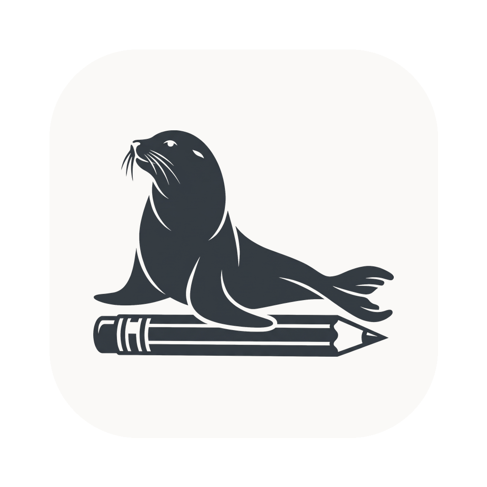

<p align="center">
  
</p>

<h1 align="center">Memotepad</h1>

<p align="center">
  A tiny, always-on-top Markdown scratchpad for macOS — summon it with a<br>
  keystroke, jot a thought, and it floats over everything without stealing focus.
</p>

<p align="center">
  <a href="LICENSE"></a>
  
  
  
</p>

Memotepad is a Raycast/Spotlight-style floating note. It lives in your menu bar, appears on top of any app — even fullscreen ones — when you hit the global shortcut, and disappears just as fast. Everything you type is plain Markdown, saved instantly to local `.md` files. There's no "edit mode" and no "preview mode": Markdown styles itself live as you type, the way Notion and Raycast Notes work.

---

## ⬇️ Download

| Build | For | |
| --- | --- | --- |
| **Apple Silicon** | M1 / M2 / M3 / M4 Macs | [Download .dmg](https://r2-dev.ribbinpo.dev/memotepad/releases/latest/memotepad-aarch64.dmg) |
| **Apple Intel** | Intel Macs | [Download .dmg](https://r2-dev.ribbinpo.dev/memotepad/releases/latest/memotepad-x64.dmg) |

> **First launch:** memotepad isn't code-signed yet, so macOS Gatekeeper will warn you. After dragging the app to **Applications**, right-click it → **Open** → **Open**. If macOS says the app is "damaged," open Terminal and run:
> ```bash
> xattr -dr com.apple.quarantine /Applications/memotepad.app
> ```

---

## ✨ Features

- **Always-on-top floating panel** — a frosted-glass window that stays above your other apps.
- **Floats over fullscreen apps** — built as a non-activating macOS `NSPanel`, so showing it never yanks you out of a fullscreen Space or steals focus.
- **Global show/hide hotkey** — summon or dismiss the note from anywhere with `⌥.` (Option + Period).
- **Menu bar app** — runs as a background agent with no Dock icon; left-click the tray icon to toggle, or use its Show / Quit menu.
- **Live Markdown editing** — a single always-editable surface (CodeMirror 6). Headings grow, `**bold**` renders bold, and syntax marks dim on inactive lines. No mode switching.
- **Rendered components** — tables, dividers (`---`), task checkboxes (`- [ ]`), radios (`- ( )`), and links render as real components right in the editor; click a checkbox to toggle it or a link to open it. Put the cursor on the line and the raw Markdown reappears so you can edit it.
- **Formatting toolbar** — don't know Markdown? A bottom toolbar inserts headings, bold, italic, lists, checklists, quotes, links, and code blocks for you.
- **Action Panel** — a `⌘K` command palette listing every action and its shortcut (new note, browse notes, export, resize, opacity, …). Search and run anything from one place.
- **Styled code** — inline `` `code` `` gets a pill background and fenced ` ``` ` blocks get a tinted band.
- **Multiple notes + search** — a `⌘P` palette to search, open, create, and delete notes.
- **Export** — copy the current note to your Downloads folder (`⌘E`) and reveal it in Finder.
- **Auto-save** — every keystroke is debounced and written to disk; nothing to save manually.
- **Plain-text storage** — notes are just Markdown files in your app-data folder. No lock-in, no database.
- **Manual & snap resizing** — drag any edge/corner to resize, or snap to preset sizes with `⌘1`–`⌘3`.
- **Adjustable translucency** — dial the panel's opacity up or down with `⌘+` / `⌘-`.
- **Remembers its place** — window size and position persist between launches.
- **Light & dark mode** — follows the system appearance automatically.

## ⌨️ Keyboard shortcuts

| Shortcut | Action |
| --- | --- |
| `⌥.` | Show / hide the note (global, works anywhere) |
| `⌘K` | Open the Action Panel (all commands) |
| `⌘P` | Browse notes (search palette) |
| `⌘N` | New note |
| `⌘E` | Export the current note to Downloads |
| `↑` / `↓` · `↵` | Navigate / run the highlighted row (in a panel) |
| `⌘⌫` | Delete the selected note (in the browse palette) |
| `⌘1` · `⌘2` · `⌘3` | Snap to compact / default / large size |
| `⌘+` / `⌘-` | Increase / decrease opacity |
| `Esc` | Close the panel, or hide the window |

## 🚀 Getting started

**Prerequisites:** [Node.js](https://nodejs.org) 18+, [Rust](https://www.rust-lang.org/tools/install), and the [Tauri prerequisites](https://tauri.app/start/prerequisites/) for macOS (Xcode Command Line Tools).

```bash
# install dependencies
npm install

# run in development
npm run tauri dev

# build a distributable .app / .dmg
npm run tauri build
```

The bundled app is produced under `src-tauri/target/release/bundle/`.

## 🗂️ Where notes live

Notes are stored as individual Markdown files under the app's data directory:

```
~/Library/Application Support/com.poom.memotepad/notes/*.md
```

Because they're plain `.md` files, you can back them up, sync them, or edit them in any other editor.

## 🧱 Tech stack

- **[Tauri 2](https://tauri.app)** (Rust) — native shell, menu bar, global shortcut, `NSPanel`
- **[React 19](https://react.dev)** + **[TypeScript](https://www.typescriptlang.org)** + **[Vite](https://vitejs.dev)**
- **[CodeMirror 6](https://codemirror.net)** — the live-Markdown editor
- **[Tailwind CSS 4](https://tailwindcss.com)** — styling

## 🗺️ Roadmap

Done so far:

- [x] Floating always-on-top panel with global hotkey
- [x] Menu bar icon + background agent
- [x] Multiple notes with search palette
- [x] Live Markdown editing (no separate preview mode)
- [x] Auto-save to local Markdown files
- [x] Opacity control, snap sizes, and manual resize

Planned / ideas:

- [ ] Pin / unpin favourite notes
- [ ] iCloud or Git folder sync
- [ ] Tags and quick filtering
- [ ] Slash / command menu for Markdown blocks (checklists, tables, dividers)
- [ ] Per-note or global themes
- [ ] Optional password lock / encryption
- [ ] Export & share (Markdown, PDF)
- [ ] First-class Windows & Linux builds

Have an idea? Open an issue — suggestions are welcome.

## 🤝 Contributing

Contributions, bug reports, and feature requests are welcome. Fork the repo, create a branch, and open a pull request. Please keep changes focused and run `npm run build` (and `cargo check` in `src-tauri/`) before submitting.

## ❤️ Support / Donation

If memotepad saves you a few keystrokes a day and you'd like to say thanks, you can support development here:

[](https://buymeacoffee.com/ribbinpo)

> Replace the links above with your own donation pages. Every bit is appreciated — thank you!

## 📄 License

Released under the [MIT License](LICENSE). © 2026 Teerawut Saesim.
